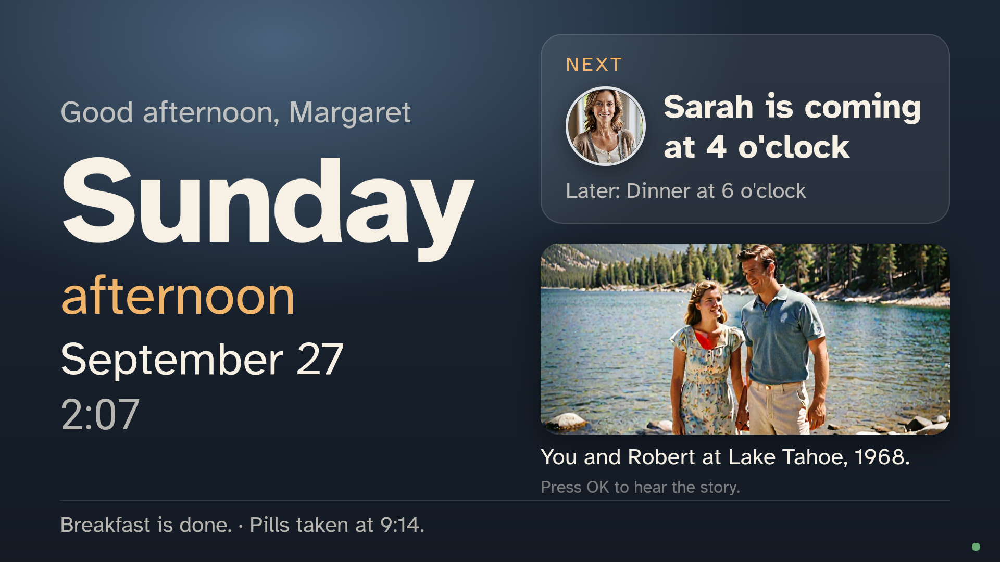

# Mantel

**Mantel is a Fire TV app that turns the living-room TV into a patient memory for a person living with dementia. It answers the questions they ask all day in their family's own words, knows who is at the door, and tells the family when something changes.**



A person living with dementia asks the same questions many times a day: what day it is, when their daughter is coming, where their husband is. Families answer them with whiteboards and day clocks, and by answering again. Mantel puts the family's answers on the screen that person already faces.

- **Today.** When the TV's camera sees someone in the room, the screen shows the day, the part of the day, the date and what happens next ("Sarah is coming at 4 o'clock", with Sarah's photo). It answers the common questions before they are asked.
- **Kind Answers.** Asked out loud, with no wake word, the TV answers with the words a family member wrote, in their own recorded voice when they recorded one, the same way the fortieth time as the first. A question it has no answer for gets "Let's look at today together." and goes to the family's phone, so the answers grow from what is actually asked.
- **At the Door.** When the Ring doorbell rings, the TV says whether a visit or a delivery was planned. When nothing was: "You're not expecting anyone. You don't need to open the door. Sarah can see who it is." Sarah gets the doorbell snapshot.
- **Moments.** Family photos with captions, and stories told in family voices, rotate slowly while the person is in the room.
- **Evening and night.** A calmer evening, and a dim night screen ("It's night-time. Everyone is asleep. Your bed is ready."). An outside door opening at night alerts the family.
- **The Change Signal.** Confusion that worsens over a day or two can be delirium, often from a treatable infection. Mantel compares the day's questions, night-time activity, night door openings and waking time with the person's own last four weeks, and tells the family about a sudden change: "Consider calling Margaret's doctor." It never diagnoses.

Every word the TV says was written or approved by the family, or computed from their plan and the clock. For the hardest questions ("Where is Robert?" about a husband who has died) the family chooses, topic by topic, whether the TV tells, redirects or comforts, starting from published caregiving guidance. Mantel never makes that choice.

---

## Run it

```bash
pnpm install
pnpm demo        # one day in Margaret's home, in the terminal, through the real server
pnpm dev         # build the web apps and start the server on :8795
```

With `pnpm dev` running:

- the TV interface in a browser: <http://localhost:8795/tv/?token=demo-tv&dev=1> (the `dev` panel stands in for the camera and microphone)
- the family app: <http://localhost:8795/family/> (sign in as Sarah, Tom or Anna)
- ring the simulated doorbell: `curl -X POST localhost:8795/api/dev/ring/press -H "content-type: application/json" -d '{"visitor":"stranger"}'`
- move the clock: `curl -X POST localhost:8795/api/dev/clock -H "content-type: application/json" -d '{"time":"03:10"}'`

No AWS account, Ring account or API key is needed for any of this. [docs/FIRE_TV.md](docs/FIRE_TV.md) installs the app on a Fire TV.

```bash
pnpm verify      # typecheck, tests, matcher evaluation, Change Signal benchmark (dev seeds)
pnpm eval        # Kind Answers on typed and spoken question sets
pnpm bench       # Change Signal on simulated households
pnpm check       # which live integrations are on, each exercised with a real call
pnpm cdk:synth   # the AWS stack
cd android && ./gradlew assembleDebug testDebugUnitTest
```

## How it works

```
Fire TV (Fire OS)                                   Mantel server (Node, local or AWS Lambda)
┌──────────────────────────────────────────┐        ┌───────────────────────────────────────────┐
│ WebView: the TV interface (React)        │ long-  │ household, plan, answers, moments         │
│   Today · answers · door · night         │ poll   │ Ring webhooks (HMAC) → door decision      │
│   matcher + answer rules (packages/core) │◀──────▶│ snapshot via Ring image download (303)    │
│ Native (Kotlin)                          │ events │ Change Signal each morning, digest 20:00  │
│   CameraX + face presence, on device     │        │ Bedrock drafts · Polly household voice    │
│   Vosk speech recognition, on device     │        │ DynamoDB · S3 · Secrets Manager (CDK)     │
│   TTS, dimming, care mode                │        └───────────────────────────────────────────┘
└──────────────────────────────────────────┘                        ▲
                                                                     │ family web app (phone)
```

The same TypeScript core (`packages/core`) runs on the TV, on the server and in the tests: the Today screen, the answer matcher, the door decision, the Change Signal and the digest. Camera frames and audio never leave the TV; the server receives events only. More in [docs/ARCHITECTURE.md](docs/ARCHITECTURE.md).

## Evidence

| What | Result | Where |
|---|---|---|
| Kind Answers, typed dev set | 65 of 67 answerable questions answered right, 0 wrong answers on 99 sentences | `pnpm eval` |
| First held-out read (92 sentences, written before being scored) | 53 of 57 right, **0 answered with the wrong topic**, 2 of 35 unanswerable sentences answered with a true statement from the clock or plan | [docs/eval/holdout_read_1.txt](docs/eval/holdout_read_1.txt) |
| Second held-out read (73 sentences) | 36 of 43 right, **0 answered with the wrong topic**, 2 of 30 answered with a true statement | [docs/eval/holdout2_read_1.txt](docs/eval/holdout2_read_1.txt) |
| Spoken: all three sets said by 4 voices and recognised by the TV's own Vosk model (1,056 utterances) | 81.4% to 89.2% right per set, **0 answered with the wrong topic** | [docs/EVAL.md](docs/EVAL.md) |
| Change Signal, 40 held-out simulated households, each with a matched null | strong changes caught within 48 h: **70.0%**, at **0.148 false alerts per household-month**; alerting on questions alone: 52.5% at 0.780 | [docs/eval/signal_holdout_read_1.txt](docs/eval/signal_holdout_read_1.txt) |
| Speech on the Fire OS stack | the Android app recognised "when is sarah coming" from audio with the on-device model and showed Sarah's answer | [docs/FIRE_TV.md](docs/FIRE_TV.md) |
| Tests | 93 TypeScript tests (core, server over HTTP, CDK, the real interfaces in Chromium), 5 on the DynamoDB engine, 8 Android unit tests | `pnpm test`, Gradle |

The Change Signal figures are from a simulation of the method. They make no clinical claim. [docs/EVAL.md](docs/EVAL.md) has the method, the order of commits, and every number.

## Repository

```
packages/core     the rules: Today, answers, door, Change Signal, digest, draft checks, simulator
apps/server       HTTP API, Ring webhook and simulator, stores (files, DynamoDB), media (disk, S3), Lambda entry
apps/tv           the TV interface (React, 10-foot UI), loaded by the Fire TV app
apps/family       the family web app (phone first)
android/app       the Fire TV app (Kotlin): WebView, CameraX presence, Vosk speech, TTS
android/caremode  a reusable library: open at boot, return to the app when the TV is left idle elsewhere
infrastructure    AWS CDK stack
tools             demo, evaluation, benchmark, doctor, media generation
fixtures          the demo household's photos and recordings, labelled question sets
docs              architecture, evaluation, safety, Fire TV setup, AWS, Ring, product feedback, friction log
```

The demo household (Margaret, Sarah, Tom, Anna), its photographs and its recordings are generated for the demo: `tools/media/`.

## License

Apache-2.0. Atkinson Hyperlegible is © Braille Institute of America, under the SIL Open Font License. The Vosk model is Apache-2.0.
