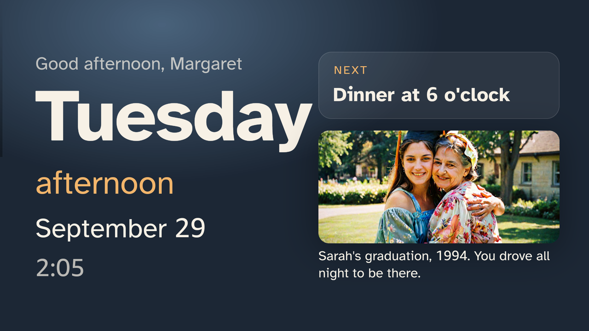

# Mantel on Vega OS

`vega/` is Mantel's TV for Vega OS: a React Native app for Vega with the same screens and behaviour as the Fire OS app's interface (`apps/tv`). It imports the shared core (`packages/core`) unchanged, so the Today screen, the answer matcher and the answer rules run on the TV. The household server is the same one, over the same API.



## What differs from the Fire OS app

| | Fire OS app | Vega app |
|---|---|---|
| Interface | the React web interface in a WebView | the same screens as native React Native views (`vega/src/screens.tsx`) |
| Presence | USB webcam, on the device | treated as present; Vega gives apps no camera |
| Questions | Vosk speech recognition, on the device | none from a microphone: Vega exposes no app-level speech recognition ([friction log 5](FRICTION_LOG.md)); a demo server can send the words (below) |
| Voice | recording, then Polly, then the device's text-to-speech | recording, then Polly; Vega has no speech engine an app can call, so a line with neither is shown and not spoken |
| Audio | the WebView's `<audio>` | `@amazon-devices/react-native-w3cmedia` `AudioPlayer` through Media Source Extensions (below) |
| Offline | the last state in `localStorage` | the last state and the event queue in AsyncStorage |
| Remote | Back, OK, Left, Right, Menu | Back (`BackHandler`), OK, Left, Right (`useTVEventHandler`) |

**Why not a WebView.** The first Vega build wrapped the web interface in `@amazon-devices/webview`. It built, but the Vega Virtual Device refused to install it: `Module dependency not found` for `/com.amazon.kepler.webview_4@IWebview_4`. The virtual device has no WebView module ([friction log 7](FRICTION_LOG.md)). The native app has no such dependency.

**Audio from a household server.** Vega's media player opens a URL only over https: every `http://` source failed with `MEDIA_ERR_SRC_NOT_SUPPORTED`, on the LAN, on the device's loopback and on the public internet, with the host in the manifest's cleartext allowlist ([friction log 8](FRICTION_LOG.md)). The app's own `fetch` does honour that allowlist. So `vega/src/voice.ts` fetches each recording, and `vega/src/mp4.ts` wraps its MP3 frames, untouched, in a minimal MP4 (Vega's MSE takes `audio/mp4; codecs="mp4a.69"` or `"mp4a.6b"`, but not a bare MP3 stream), and plays it through a `MediaSource`. Decoded, a Polly clip wrapped this way is byte-identical to the original; `tests/vega-mp4.test.ts` checks the boxes, the sample table and the chunk offset.

## Build and run

The Vega SDK runs on Linux and macOS. On Windows, Amazon's guide does not support it; it ran here under WSL 2 (below).

```bash
# once: the Vega SDK (Linux or macOS; on Windows inside WSL 2)
curl -fsSL https://sdk-installer.vega.labcollab.net/get_vvm.sh -o get_vvm.sh
NONINTERACTIVE=true bash get_vvm.sh && source ~/vega/env

# point the app at the household server and the TV's token, then build, install and launch
node tools/vega/configure.mjs --server http://192.168.1.20:8795 --token <tv token>
bash tools/vega/build.sh --run
```

`configure.mjs` writes `vega/src/config.ts` and puts the server's host in the manifest's cleartext allowlist. `build.sh` builds in a copy that keeps the repository's layout (`vega/` beside `packages/core/`), because Metro resolves the core from `../packages/core`; on WSL that copy also keeps `node_modules` on the Linux file system. It produces `.vpkg` files for x86_64 (the virtual device), armv7 and aarch64.

Checks, in the build copy (`~/mantel-build/vega`): `npx tsc --noEmit -p .`, `npx eslint src test --ext .ts,.tsx`, `npx jest` (renders the app against a stubbed server and finds the Today screen's day).

### The Vega Virtual Device under WSL 2

What was used: Windows 11 with virtualization on, WSL 2 with Ubuntu 22.04 and systemd, `/dev/kvm` present inside WSL (nested virtualization; the emulator warns about it and runs), and WSLg for the device's window.

```bash
source ~/vega/env
vega virtual-device start --timeout 300     # keep this shell open: the device stops when the starting session ends
vega device list                            # VirtualDevice : tv - x86_64
```

- **The server.** From WSL, a server on Windows is at the WSL gateway (`ip route | awk '/default/ {print $3}'`, here `172.22.176.1`), and the virtual device reaches the same address. `configure.mjs` defaults to `http://172.22.176.1:8795`.
- **Audio.** While the virtual device ran, WSLg's PulseAudio server stopped answering (`pactl info` timed out) and the player's clock stopped at about half a second. Started with `QEMU_AUDIO_DRV=none`, the device plays to a null output: Sarah's recording then ran to `ended` in real time, silently.

## Driving the virtual device

The virtual device has neither camera nor microphone, so a demo server stands in for both:

```bash
# she comes into the room / leaves it
curl -X POST localhost:8795/api/dev/tv/input -H "content-type: application/json" -d '{"present":true}'
# the words she says, as a recogniser would pass them on
curl -X POST localhost:8795/api/dev/tv/input -H "content-type: application/json" -d '{"heard":"when is sarah coming"}'
```

The TV takes each new input once, and ignores whatever was waiting when it connected. The endpoint exists only when the server runs with demo data (the default for `pnpm dev`; off with `MANTEL_DEMO=0`).

The remote, on the device (the emulator console's `event send` did not reach the app; `inputd-cli` did):

```bash
vega device run-cmd -c 'inputd-cli button_press KEY_BACK'     # also KEY_LEFT, KEY_RIGHT, KEY_ENTER (OK)
```

A key sent this way can reach the app a few seconds after the command returns.

Screens: the emulator console (`localhost:5554`, after `auth` with `~/.emulator_console_auth_token`) takes `screenrecord screenshot <dir>` and `screenrecord start --size 1920x1080 --fps 30 <file.webm>`. The demo film's TV footage was recorded this way, with the actions above sent at planned seconds.

## Verified on the Vega Virtual Device

SDK 0.24.12112, React Native for Vega 0.83, x86_64 debug build, against the demo household on a server on the Windows host.

| What | Seen |
|---|---|
| Today | day, part of day, date, clock, next item with portrait, later items, done items, photos with captions, the sky light; morning, afternoon and night |
| A question sent as words | "when is sarah coming" → Sarah's answer from the plan, with her photo; "where is robert" → Sarah's redirect with the Lake Tahoe photo and "Sarah, on Friday" |
| Sarah's recording | fetched, wrapped in MP4, played through `MediaSource` to `ended` (with the null audio output above) |
| Ring doorbell (simulator) | the unexpected card with the snapshot; the expected-visit card ("That's probably Sarah.") |
| A family message | the morning message plays when the person is in the room |
| The remote | Back closes a door card; Left and Right browse photos; OK on the Tahoe photo opens its story |
| Night | "It's night-time.", the clock, two calm lines |

Not verified: a physical Fire TV running Vega OS, and audible sound from the virtual device on this computer.
